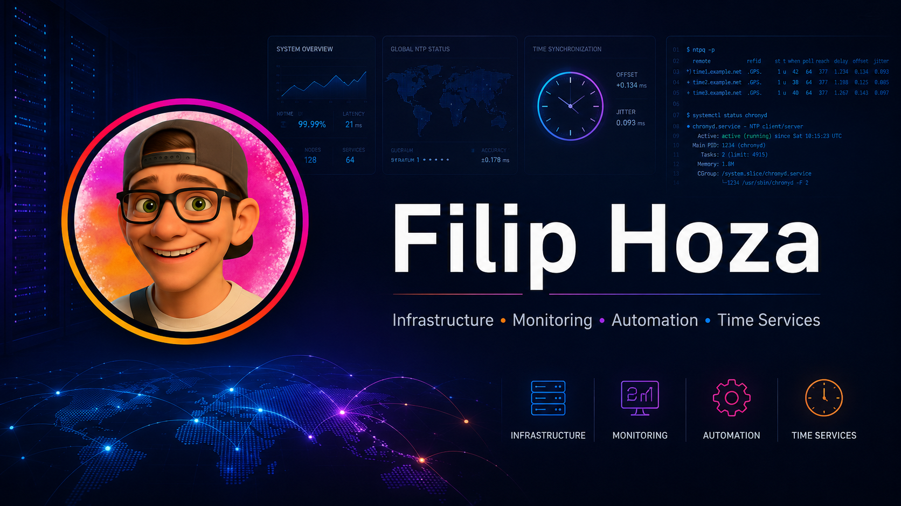

# Filip Hoza



<h3 align="center">
Infrastructure • Monitoring • Automation • Time Services
</h3>

<p align="center">
  <a href="https://github.com/FilipooSVK">
    
  </a>
  
  
</p>

---

## 👋 Hey there

I'm **Filip**, an IT specialist building practical infrastructure tools for real-world IT operations.

I work on projects around **secure time infrastructure**, **monitoring**, **Windows automation**, **homelab operations** and **internal services**.

I like turning infrastructure problems into tools that are easier to deploy, understand and operate.

---

## 🚀 Main focus

### Stratus OS

**Stratus OS** is my main infrastructure project.

It is a secure and observable NTP appliance concept for Raspberry Pi, built around:

- Chrony-based NTP service
- GPS/PPS time synchronization
- Prometheus monitoring
- Grafana dashboards
- read-only appliance-style design
- infrastructure health and degradation detection

The idea is simple:

> Time infrastructure should not be invisible.  
> It should be measurable, monitored and trusted.

---

## 🧩 Projects I build

| Project | Description |
|---|---|
| **Stratus OS** | Secure and observable NTP appliance OS for Raspberry Pi |
| **DriverCraft** | Windows driver export and backup utility for IT admins |
| **Kyronix tools** | Internal TLS, reverse proxy and infrastructure automation |
| **Monitoring stack** | Prometheus, Grafana, exporters and health checks |
| **Windows automation** | PowerShell tooling for endpoint and admin workflows |

---

## 🧠 Current interests

I'm exploring how infrastructure can become more:

- observable
- explainable
- resilient
- automated
- easier to operate

Most monitoring systems detect problems when something is already broken.

I'm interested in systems that can detect **silent degradation** before it becomes an incident.

---

## 🛠️ Tech stack

<p>
  
  
  
  
  
  
  
  
  
  
</p>

---

## ⚙️ What I enjoy building

```text
Infrastructure that is visible.
Automation that saves time.
Monitoring that explains problems.
Tools that solve real IT issues.
